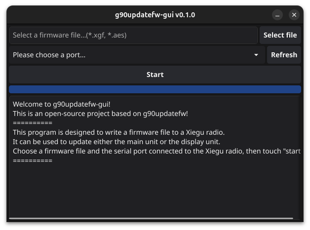
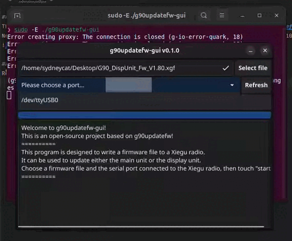

# g90updatefw-gui

## Introduction
This is the GUI version of [g90updatefw](https://github.com/DaleFarnsworth/g90updatefw), It uploads firmware updates to the Xiegu G90 and Xiegu G106 radios.

In other words it is same as g90updatefw but with a gui interface.

## Usage
Really simple, Just:
+ Connect cable to your computer
+ Choose firmware and port
+ Click "start"

Should work on windows/linux/macOS but only tried on ubuntu 24.04

but don't forget to run it with `sudo -E` or `sudo` on Linux!

## Releases
Sorry I am too lazy to build them... Open an issue if you really need them!
